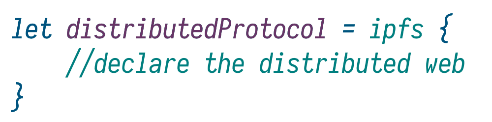

# IPFS DSL



A declarative embedded language for building compositional programs and protocols over the InterPlanetary File System.


## Language example (docs to come)

The following lazy computation expression yields an AST that captures the notion of adding a in-memory stream to the local IPFS node, which can be reasoned about and transformed.

```fsharp
// preliminaries, types you would write to model the boundary between your code and mine
type StartContext =
    | AddStream of Stream * fn:string * fo:AddFileOptions

type EndContext =
    | Finished of IFileSystemNode

type Ctx =
    | Start of StartContext
    | End of EndContext

// a context reader
let addStreamArgs : FileSystemDSLArgsEffect<Ctx> =
    function
    | Start(sctx) ->
        match sctx with
        | AddStream(s, fn, fo) ->
            FileSystemDSLArgs.prepareAddStream s fn fo Cancellation.dontUse

        // we don't match on the other case to make the program crash fast,
        // the DSL assumes the context to be consistent
        
// a program that uses the file system subDSL
let addStream (client:IpfsClient) (continuation:FileSystemDSLResultContext<'a>) =
    FileSystemProcedure(
        Effects.constant (FileSystemDSL.addStream client),
        addStreamArgs,
        continuation) |> liftFreer

// context variable
let mutable ctx = monad {
    File.WriteAllBytes("testFile.bin", [|24uy;55uy;22uy;66uy;0uy;99uy;|])
    use fs = File.OpenRead("testFile.bin")
    return! Start(AddStream(fs, "testFile.streamed.bin", AddFileOptions()))
}

let finish node = ctx <- End(Finished(node))

// a continuation that receives the result
let retrieveCid :FileSystemDSLResultContext<Async<unit>> = 
    function
    | AddStreamResult(afsnode) -> async {
        let! node = afsnode
        return finish node }

    | _ -> async {return ()}
```

To run this abstract fragment, you would

```fsharp
let client = IpfsClient()
let r = Async.RunSynchronously (IpfsDSL.run ctx (addStream client retrieveCid))
```

### What's in the algebra

Main DSL | Sub DSL | Args | Result | Low-level API docs
---------|---------|------|--------|-------------------
BitswapProcedure | BitswapDSL | BitswapDSLArgs | BitswapDSLResult | [read](https://richardschneider.github.io/net-ipfs-core/api/Ipfs.CoreApi.IBitswapApi.html)
BlockProcedure | BlockDSL | BlockDSLArgs | BlockDSLResult | [read](https://richardschneider.github.io/net-ipfs-core/api/Ipfs.CoreApi.IBlockApi.html)
BootstrapProcedure | BootstrapDSL | BootstrapDSLArgs | BootstrapDSLResult | [read](https://richardschneider.github.io/net-ipfs-core/api/Ipfs.CoreApi.IBootstrapApi.html)
ConfigProcedure | ConfigDSL | ConfigDSLArgs | ConfigDSLResult | [read](https://richardschneider.github.io/net-ipfs-core/api/Ipfs.CoreApi.IConfigApi.html)
DagProcedure | DagDSL<'Out> | DagDSLArgs | DagDSLResult<'Out> | [read](https://richardschneider.github.io/net-ipfs-core/api/Ipfs.CoreApi.IDagApi.html)
DhtProcedure | DhtDSL | DhtDSLArgs | DhtDSLResult | [read](https://richardschneider.github.io/net-ipfs-core/api/Ipfs.CoreApi.IDhtApi.html)
DnsProcedure | DnsDSL | DnsDSLArgs | DnsDSLResult | [read](https://richardschneider.github.io/net-ipfs-core/api/Ipfs.CoreApi.IDnsApi.html)
FileSystemProcedure | FileSystemDSL | FileSystemDSLArgs | FileSystemDSLResult | [read](https://richardschneider.github.io/net-ipfs-core/api/Ipfs.CoreApi.IFileSystemApi.html)
GenericProcedure | GenericDSL | GenericDSLArgs | GenericDSLResult | [read](https://richardschneider.github.io/net-ipfs-core/api/Ipfs.CoreApi.IGenericApi.html)
KeyProcedure | KeyDSL | KeyDSLArgs | KeyDSLResult | [read](https://richardschneider.github.io/net-ipfs-core/api/Ipfs.CoreApi.IKeyApi.html)
NameProcedure | NameDSL | NameDSLArgs | NameDSLResult | [read](https://richardschneider.github.io/net-ipfs-core/api/Ipfs.CoreApi.INameApi.html)
ObjectProcedure | ObjectDSL | ObjectDSLArgs | ObjectDSLResult | [read](https://richardschneider.github.io/net-ipfs-core/api/Ipfs.CoreApi.IObjectApi.html)
PinProcedure | PinDSL | PinDSLArgs | PinDSLResult | [read](https://richardschneider.github.io/net-ipfs-core/api/Ipfs.CoreApi.IPinApi.html)
PubSubProcedure | PubSubDSL | PubSubDSLArgs | PubSubDSLResult | [read](https://richardschneider.github.io/net-ipfs-core/api/Ipfs.CoreApi.IPubSubApi.html)
SwarmProcedure | SwarmDSL | SwarmDSLArgs | SwarmDSLResult | [read](https://richardschneider.github.io/net-ipfs-core/api/Ipfs.CoreApi.ISwarmApi.html)

All of these correspond to calling the lower-level IPFS API methods. Some names may be changed slightly.

Generally the IPFS DSL wraps around the lower-level API in the following way:

- each API gets it's own DSL **InameAPI -> nameDSL**
- the parameters of methods of the API get a constructor case in the type **nameDSLArgs**
- however, those are private, you construct the args by calling the static prepare methods
- the return types of the methods get wraped in **Async** or **AsyncSeq**
- the return types of the methods get a constructor case in the type => *nameDSLResult*
- you use those to pattern match when deciding what to do with results

#### Typeparams and free

**'Out** - DagDSL includes a method that deserializes a JSON object to a native .NET object. That method gets parameterized with the 'Out parameter even if you don't use the DagDSL in your program because it's subsumed to the main IpfsDSL. If do use it, remember that you can **flatMapR** to change the return type.

The other and more important typeparam is **'Cont**, it is used to capture the type of the next step of your program. Examine the free monad construction for the **IpfsDSL**.

```fsharp
// the "free monad", also called a program, this little recursive structure models all possible
// execution scenarios of using the IPFS API with the embedded langauge, more precisely,
// the following two can occur:
// (1) the program you write never terminates, and gets stuck in an infinite recursive loop
// (2) the program iterates recursively until it reaches a value, which it returns and terminates
type IpfsClientProgram<'Cont,'R> =
    // Free, the recursive step,
    // a statement in the embedded language about the next step in the program
    | Free of IpfsDSL<IpfsClientProgram<'Cont,'R>,'R>

    // Return, the final state,
    // a pure value returned by the program,
    // or another program
    | Return of 'Cont
```

## Acknowledgements

Built over the [net-ipfs-api](https://github.com/richardschneider/net-ipfs-api) and [net-ipfs-core](https://github.com/richardschneider/net-ipfs-core) by Richard Schneider. Many thanks!

## MIT License

Copyright © 2018 ČlovëekProjeqt [(cloveekprojeqt@gmail.com)](mailto:cloveekprojeqt@gmail.com) 
